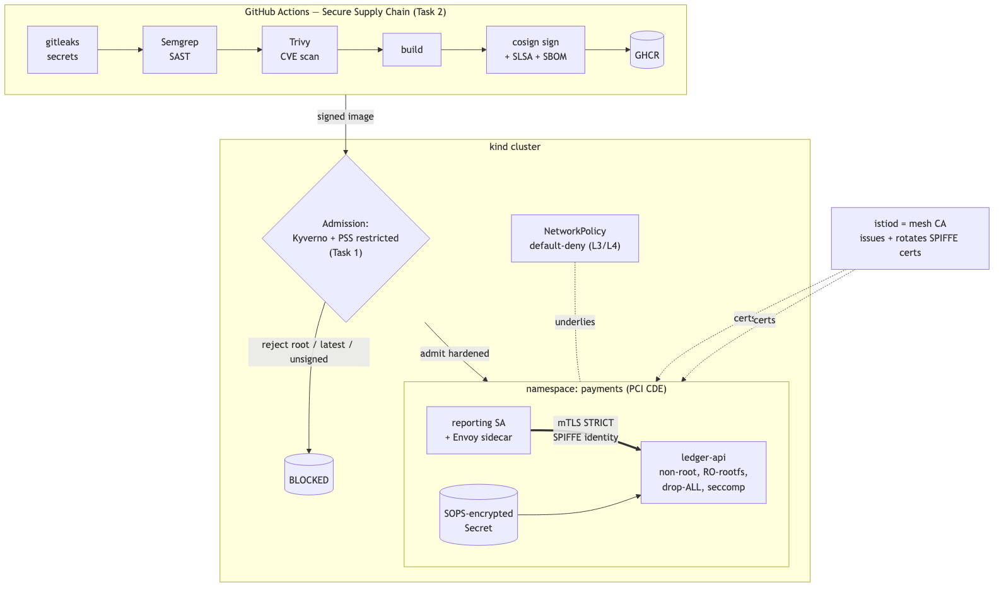
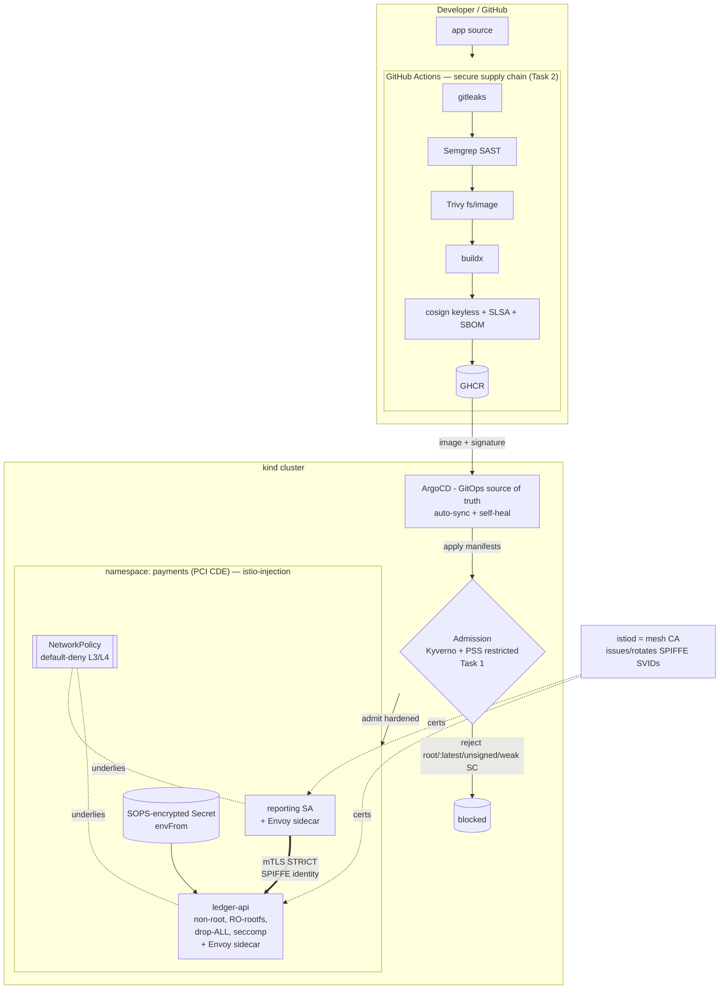
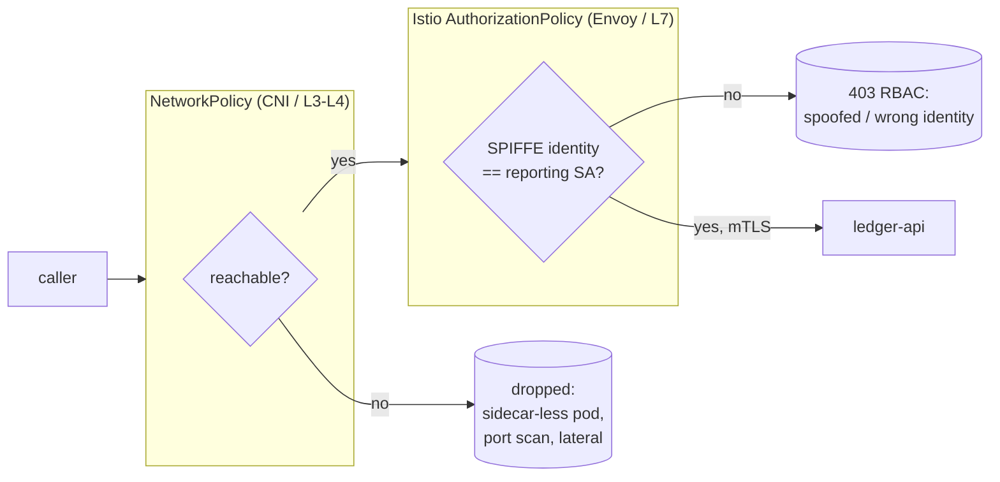
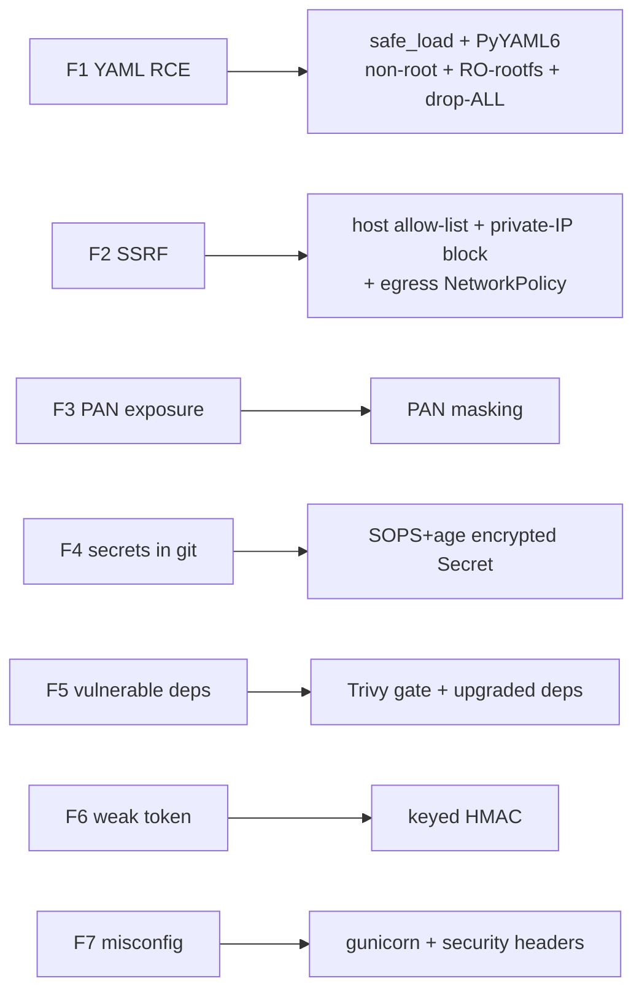

# Architecture

**Rendered image:** 
**Editable source:** [`architecture.drawio`](architecture.drawio) (open in draw.io / diagrams.net) ·
Mermaid sources below render on GitHub.

## End-to-end: build → admit → run → mesh

## Zero-trust layers (Task 3) — what each catches

## Attack → control mapping (Task 4 retest)

Render: paste into <https://mermaid.live> or view on GitHub (native Mermaid).
